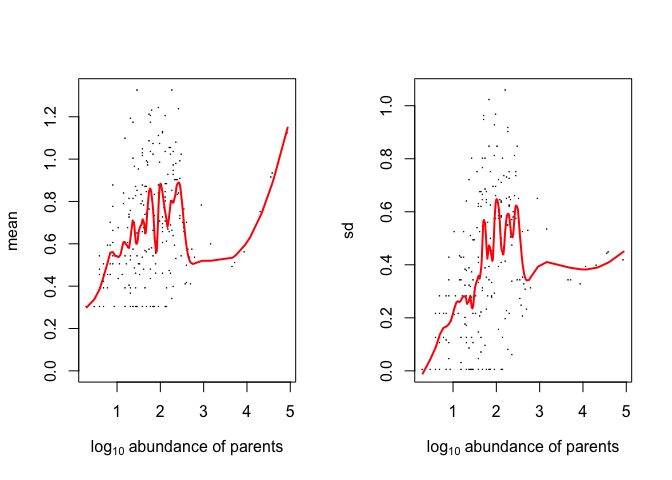

<!-- README.md is generated from README.Rmd. Please edit that file -->

# HashSeq

<!-- badges: start -->

<!-- badges: end -->

HashSeq has been developed to infer true biological 16S rRNA sequence
variants from sequence errors generated from an Illumina sequecing
instrument.HashSeq utilized a very fast HashMap-based approach to
cluster sequence variants with one nucleotide difference. It further
uses the normal distribution combined with loess regression to estimate
background error rates as a function of sequencing depth for individual
clusters. This estimated error rate is used to infer true sequences from
the background error.

Note: This package requires Java.

## Installation

Install from github with:

``` r
# install.packages("devtools")
devtools::install_github("FarnazFouladi/HashSeq")
```

## Example

For this example, we use three three mock community 16S rRNA that are
publicly available at NCBI under project\# PRJEB24409. Primers from
these sequences were removed, forward and reverse reads were paired and
sequence lengths were trimmed to 250 bases. The pre-processed samples
are available at
<https://github.com/FarnazFouladi/Examples/tree/main/zymo>. Therefore,
we first download these sequences in a local directory using the
following code:

``` r
# Set an input directory where you want to download the sequences
seqDir <- "/Users/farnazfouladi/example/sequences"
# Create temp file to store downloaded zip file
temp <- tempfile(fileext = ".zip")
# Download zip file into temp file
download.file("https://github.com/FarnazFouladi/Examples/raw/main/zymo.zip",temp)
# Unzip files into input directory
unzip(zipfile=temp, exdir=seqDir)
# Delete temp file
unlink(temp)
```

Then we set our input directory where fastq files are placed, output
directory and a threshold filtering. The output directory does not have
to exit. Here we choose a threshold of 1000 and that means sequence
variants that have total reads less than 1000 reads across all samples
are removed.

``` r
library(HashSeq)
inputDir <- "/Users/farnazfouladi/example/sequences/zymo"
outputDir="/Users/farnazfouladi/example/output"
threshold=1000
```

Then we run the inferTrueSequences to generate a count table: There are
a few files that are generated by this method: 1.
OneMismatchCluster.txt: This file contains all parents and one-mimatch
children for all clusters. 2. childrenProperties.txt: This file contains
mean, standard deviation, and variance for each cluster. 3.
InferenceTestSignificantChildren.txt: This file includes one-mismatch
children that were significant in an inference test. 4. sequences.fasta:
This file includes all parents above the threshold and the significant
one-mismatch children from step 3. 5. SvTable.txt: This count table
includes all sequences from step 4. This table can be used for taxonomic
assignment and other down-stream analyses.

``` r
inferTrueSequences(inputDir,outputDir,threshold)
#> [1] "***************PLEASE WAIT.  PROCESSING INPUT SEQUENCES***************"
#> [1] "Class Path: /Library/Frameworks/R.framework/Versions/4.0/Resources/library/rJava/java"                                                       
#> [2] "Class Path: /private/var/folders/xy/_t9k7cp17rlf0j7xk3l006zh0000gn/T/RtmpCPf92c/temp_libpathf67c62aa3c26/HashSeq/extdata/SequenceVariant.jar"
#> [1] "*****Dimensions of Cluster Table*****"
#> [1] "number of rows: 5643"
#> [1] "number of columns: 10"
#> 
#> [1] "*****Dimensions of Abundance Parents Table*****"
#> [1] "number of rows: 9"
#> [1] "number of columns: 2"
#> 
#> [1] "*****Dimensions of Children Properties Table*****"
#> [1] "number of rows: 230"
#> [1] "number of columns: 10"
#> 
#> [1] "*****Dimensions of Significant Children Table*****"
#> [1] "number of rows: 26"
#> [1] "number of columns: 12"
#> 
#> [1] "Class Path: /Library/Frameworks/R.framework/Versions/4.0/Resources/library/rJava/java"                                                       
#> [2] "Class Path: /private/var/folders/xy/_t9k7cp17rlf0j7xk3l006zh0000gn/T/RtmpCPf92c/temp_libpathf67c62aa3c26/HashSeq/extdata/SequenceVariant.jar"
#> [1] "******INFERENCE PROCESSING IS COMPLETE******"
#> [1] "TODO:  Add text that informs the user about which methods can be invoked to visualize results."
```

We can visualize the relationship between mean and standard deviation of
one-mismatch children and their parents. This visualization helps us to
to set a threshold.

``` r
#Add file name
makeLoessPlot(outputDir,clusterProps)
```


