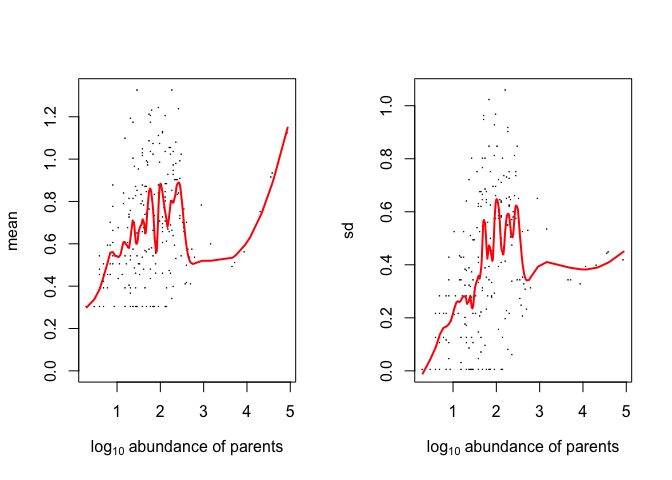

<!-- README.md is generated from README.Rmd. Please edit that file -->

# HashSeq

<!-- badges: start -->

<!-- badges: end -->

The goal of HashSeq is to infer true biological 16 rRNA sequences from
background error.

## Installation

Install from github with:

``` r
# install.packages("devtools")
devtools::install_github("FarnazFouladi/HashSeq")
```

## Example

Specify the input directory including sequences, and output directory,
and a filter threshold where it is used to remove low abundant sequence
variants.

``` r
library(HashSeq)
inputDir="inst/extdata/example/sequences"
outputDir="inst/extdata/example/output"
threshold=1000
```

Run the inferTrueSequences to generate a count table

``` r
inferTrueSequences(inputDir,outputDir,threshold)
```

Visualize the mean and standard deviation of one-mimatch variants

``` r
makeLoessPlot(outputDir,clusterProps)
```


